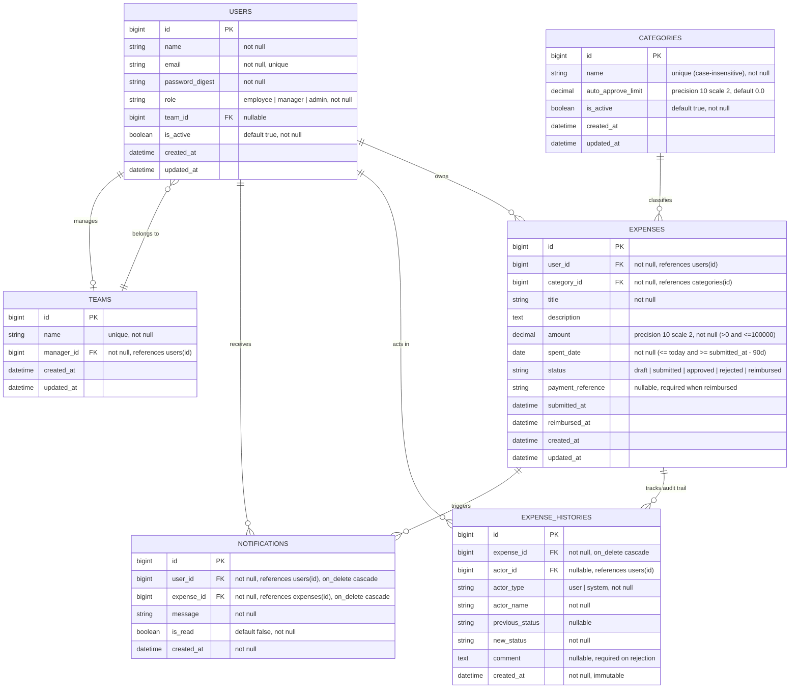

# ExpenseFlow Entity-Relationship Diagram (ERD)

Below is the database architecture and entity relationships for ExpenseFlow.

## Mermaid Entity-Relationship Diagram

## Data Model Design Highlights

1. **Self-Referential User & Team Hierarchy**:
   - Every user belongs to at most one team (`team_id`).
   - Every team has exactly one manager (`manager_id` on `teams` foreign key referencing `users`).
   - A model validation enforces that a team's manager must have the `manager` role.
2. **Auto-Approval Rules**:
   - `categories.auto_approve_limit` enables instantaneous system approval when `expense.amount <= auto_approve_limit` upon submission.
3. **Immutable Audit Trail (`expense_histories`)**:
   - Records every state transition, who made it (`user` or `system`), previous status, new status, reviewer comments / rejection reasons / payment reference, and timestamp.
   - Guarded by model hooks preventing modification or deletion.
4. **Instant In-App Notifications (`notifications`)**:
   - When an expense state changes, notification records are generated for the expense owner.
